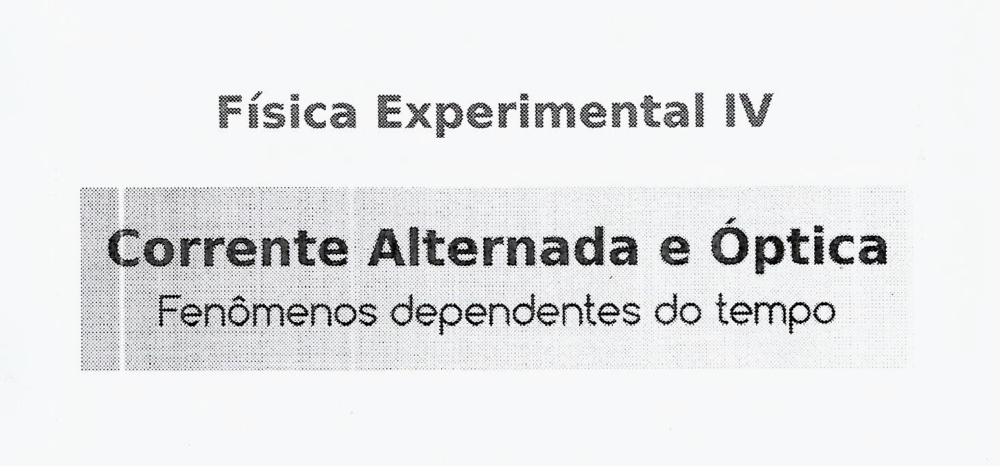

  

<h1 align="center">
    💻 Automatiza Lab IV 🔬
</h1>

    Projeto pessoal que visa refinar a análise dos dados coletados na disciplina de <b>Física Experimental 4</b>, evitando erros caso o trabalho fosse feito manualmente.

## ⚙ Tecnologias:

- JavaScript
- Python
- Git e Github